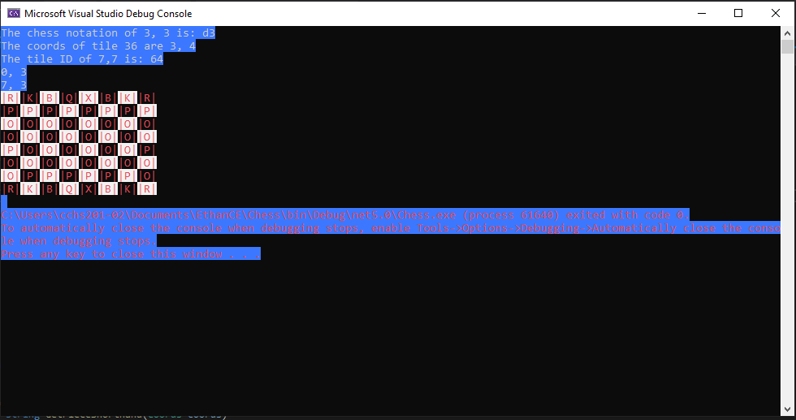

# chess (https://github.com/ethancedwards8/chess)
Chess programmed in raw C#. This was my midterm project for my Game Design class. The
board is stored as a 2-dimensional array and the pieces are their own objects with their
properties that allow them to move. Pieces can be moved by either their coordinages (2, 3)
or their board tile (E4). 

